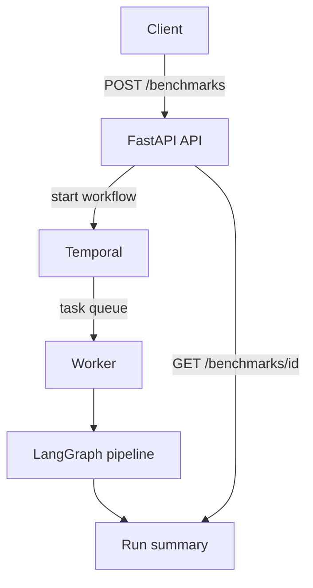
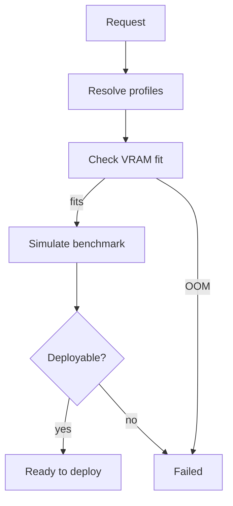
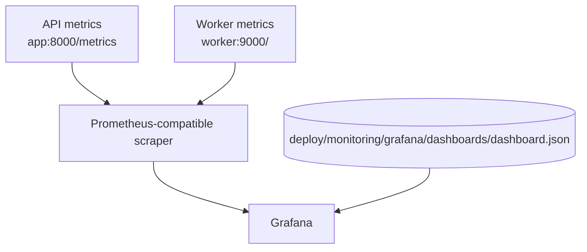
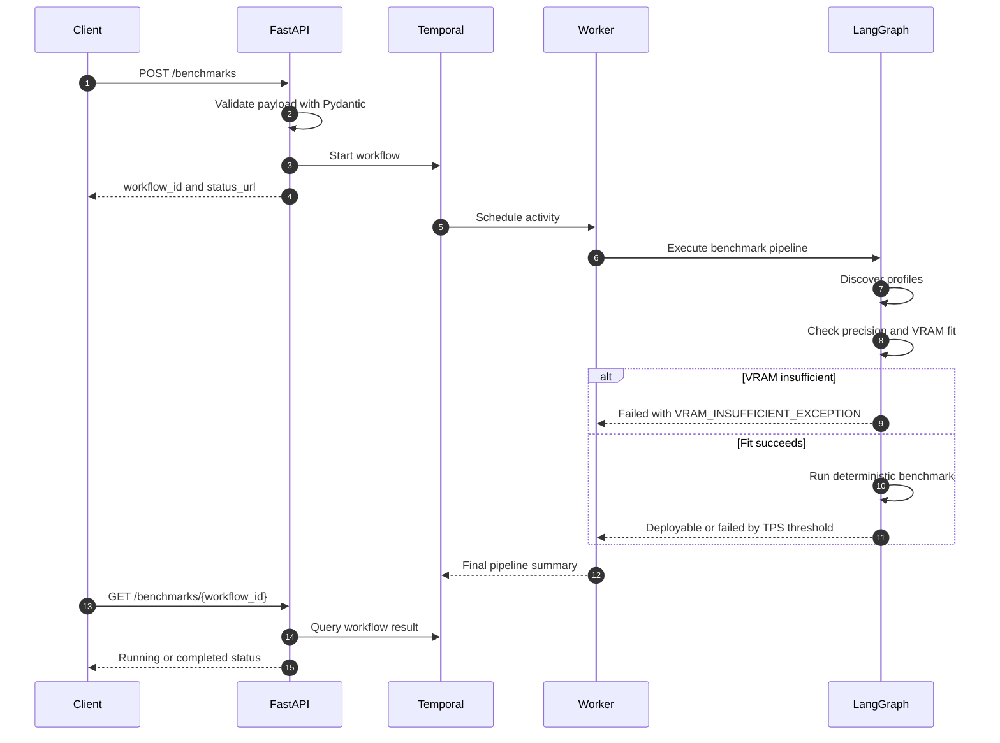
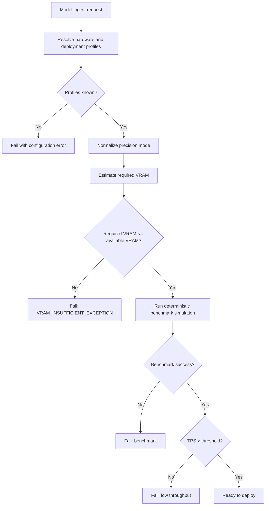
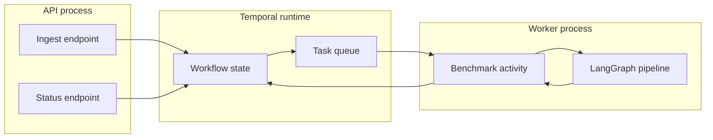
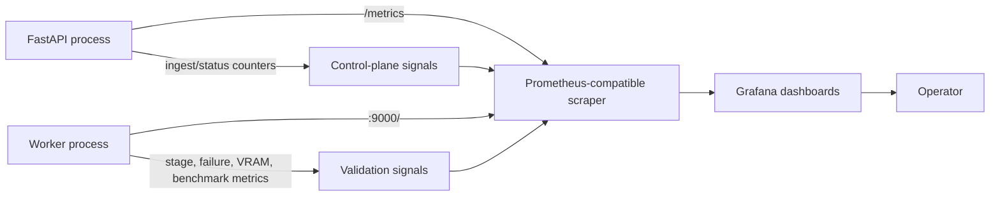

# LLM GPU Benchmarking

A proof of concept for a distributed LLM GPU benchmark control plane.

The project accepts a model request, selects a target hardware and deployment
profile, starts a Temporal workflow, executes a LangGraph pipeline in a worker,
validates hardware fit with a deterministic validation matrix, and exposes
Prometheus metrics for dashboarding.

This repository treats a local laptop as the production-like environment for the
POC. The control-plane boundaries, deployment paths, validation decisions,
observability, and operational scripts are structured like a real service, while
GPU provisioning and model-service artifact publishing remain simulated.

## Design Status

| Area | Current status |
| --- | --- |
| API control plane | FastAPI service in `src/main.py` |
| Distributed execution | Temporal workflow plus separate worker process |
| Pipeline orchestration | LangGraph state machine inside the worker activity |
| Hardware validation | Deterministic validation matrix by default |
| Hosted runtime validation | Optional NVIDIA-hosted OpenAI-compatible validation mode |
| Observability | Prometheus metrics and a provisioned Grafana dashboard JSON |
| Local deployment | Helm chart with ingress for Rancher Desktop or another local cluster |
| Production readiness | Local-prod POC; see remaining gaps below |

## Problem Statement

An LLM GPU benchmarking service needs to answer an operational question before spending real GPU
time: can this model run on this target hardware, with this precision mode, in
this deployment environment?

This implementation makes validation data-driven and deterministic. A request for a large model on
small hardware can fail for the right reason, expose that failure through the API
result, increment Prometheus counters, and show up in Grafana.

## Goals

- Model the control-plane request lifecycle from ingest to final deployability
  decision.
- Keep API ingestion asynchronous so clients are not blocked by compile and
  benchmark phases.
- Use Temporal for durable workflow orchestration and a separate worker process
  for benchmark execution.
- Use LangGraph to keep pipeline stages explicit and testable.
- Replace hardcoded success responses with a validation matrix that reacts to
  model size, target VRAM, and precision mode.
- Emit metrics that explain throughput, bottlenecks, failure reasons, worker
  activity, VRAM usage, and precision-mode impact.
- Keep the project runnable locally through one Kubernetes Helm lifecycle script.

## Non-Goals

- This POC does not provision real GPU nodes.
- This POC does not build or publish a real model-service artifact.
- The default validation path does not execute inference on physical hardware.
- The local Temporal server uses Temporal's development mode, not a production
  persistence backend.
- Authentication, authorization, audit logging, artifact storage, and CI/CD
  hardening are not implemented in the local-prod POC.

## Architecture

### Runtime Components



### Benchmark Pipeline



### Observability



## Component Responsibilities

| Component | File | Responsibility |
| --- | --- | --- |
| API entrypoint | `src/main.py` | Exposes health, metrics, ingest, and status endpoints. Connects to Temporal and starts workflows. |
| Request schema | `src/schemas.py` | Defines `ModelIngestRequest` and `PrecisionMode`. |
| Workflow | `src/workflows.py` | Defines the Temporal workflow wrapper and retry policy. |
| Worker | `src/worker.py` | Connects to Temporal, starts worker metrics, and executes queued activities. |
| Activity | `src/activities.py` | Runs the benchmark pipeline and records Prometheus metrics. |
| Benchmark graph | `src/benchmark_graph.py` | Defines the LangGraph stages and success/failure routing. |
| Validation matrix | `src/validation_matrix.py` | Estimates VRAM fit and deterministic benchmark output. |
| Provisioning facade | `src/mcp_provisioning.py` | Loads hardware/deployment profiles and chooses validation backend. |
| Hosted runtime client | `src/nim_runtime_client.py` | Optional OpenAI-compatible NVIDIA hosted validation client. |
| Metrics | `src/metrics.py` | Owns Prometheus counters, gauges, and histograms. |

## Project Layout

| Path | Purpose |
| --- | --- |
| `src/` | Runtime Python modules for API, Temporal worker, graph, validation, and metrics. |
| `src/config/` | Hardware, deployment, and hosted-model profile JSON. |
| `test/` | Unit tests for schemas, graph routing, provisioning, and hosted validation. |
| `examples/` | Curl examples and validation-matrix load generator. |
| `docs/` | Local production runbook, non-technical overview, and operator-facing documentation. |
| `scripts/` | Kubernetes lifecycle, test, load, and validation scripts. |
| `Dockerfile` | Application image definition used by API and worker containers. |
| `.dockerignore` | Root Docker build-context ignore rules. |
| `helm/llm-gpu-benchmarking/` | Local Kubernetes Helm chart with API, worker, Temporal, service, and ingress resources. |
| `deploy/monitoring/grafana/` | Provisioned Grafana datasource and dashboard. |
| `openapi.yaml` | Checked-in API contract. |

Runtime commands use `PYTHONPATH=src` and module names such as `main`,
`worker`, and `benchmark_graph`.

## Request Lifecycle



1. A client submits `POST /benchmarks`.
2. FastAPI validates the payload with Pydantic.
3. FastAPI creates a unique Temporal `workflow_id`.
4. Temporal stores and schedules the workflow.
5. A worker picks up the workflow activity from `llm-gpu-benchmarking-task-queue`.
6. The worker invokes the LangGraph pipeline.
7. The graph discovers hardware and deployment metadata from JSON config.
8. The graph records a quantized precision profile for `INT8` or `INT4`.
9. The graph compiles a validation-matrix plan and checks VRAM fit.
10. If VRAM is insufficient, the run fails with `VRAM_INSUFFICIENT_EXCEPTION`.
11. If the model fits, the benchmark harness emits deterministic throughput,
    latency, VRAM, and accuracy metrics.
12. The graph routes the run to publish or failure based on validation success
    and the configured TPS threshold.
13. The activity records metrics and returns the final pipeline summary.
14. A client polls `GET /benchmarks/{workflow_id}` for completion.

## API Contract

The checked-in OpenAPI contract lives at:

```text
openapi.yaml
```

When the API is running, FastAPI also exposes interactive docs at:

```text
http://llm-gpu-benchmarking.localhost/docs
```

### Ingest

```http
POST /benchmarks
Content-Type: application/json
```

```json
{
  "model_name": "Llama-3-70B",
  "target_gpu": "A10G-24GB",
  "target_environment": "kubernetes",
  "precision_mode": "FP16"
}
```

Fields:

| Field | Required | Notes |
| --- | --- | --- |
| `model_name` | Yes | Exact configured model name or a name with a size token such as `70B`. |
| `target_gpu` | Yes | Matched against `src/config/hardware_profiles.json`. |
| `target_environment` | No | Defaults to `kubernetes`; matched against deployment targets. |
| `precision_mode` | No | Defaults to `FP16`; supported values are `FP16`, `INT8`, and `INT4`. |

Example response:

```json
{
  "message": "Benchmark run initiated.",
  "workflow_id": "llm-gpu-benchmarking-llama-3-70b-fp16-a1b2c3d4",
  "status_url": "/benchmarks/llm-gpu-benchmarking-llama-3-70b-fp16-a1b2c3d4",
  "precision_mode": "FP16"
}
```

### Status

```http
GET /benchmarks/{workflow_id}
```

While running:

```json
{
  "workflow_id": "llm-gpu-benchmarking-llama-3-70b-fp16-a1b2c3d4",
  "status": "RUNNING"
}
```

After completion:

```json
{
  "workflow_id": "llm-gpu-benchmarking-llama-3-70b-fp16-a1b2c3d4",
  "status": "COMPLETED",
  "pipeline_summary": {
    "model": "Llama-3-70B",
    "hardware": "A10G-24GB",
    "environment": "kubernetes",
    "precision_mode": "FP16",
    "final_status": "Failed",
    "deployable": false,
    "error_log": "VRAM_INSUFFICIENT_EXCEPTION: model Llama-3-70B requires 158.80GB VRAM with FP16, but A10G-24GB exposes 24.00GB. for model Llama-3-70B on A10G-24GB in kubernetes (PCIe; error_rate=1.0)."
  }
}
```

## Validation Matrix Design

The default runtime mode is deterministic local validation:

```bash
LLM_GPU_BENCHMARKING_VALIDATION_MODE=validation
```

The validation matrix answers two questions:

- Compile fit: does the model weight footprint fit into the target VRAM?
- Benchmark expectation: if it fits, what throughput, latency, VRAM use, and
  accuracy should this target produce for the selected precision mode?



### Core Business Logic

The business decision is not "did the workflow run?" It is "is this model
deployable on this hardware, in this environment, with this precision mode?"

The pipeline makes that decision in this order:

1. Ingest accepts `model_name`, `target_gpu`, `target_environment`, and
   `precision_mode`, then creates a Temporal workflow with status `Ingested`.
2. Discovery resolves the requested hardware and environment to configured
   profiles. Unknown hardware or deployment labels fail instead of falling back
   to a generic target.
3. Precision handling normalizes aliases such as `4BIT` or `AWQ` to `INT4`.
   `FP16` skips the precision-profile stage because it is the baseline mode.
   `INT8` and `INT4` record precision metadata before compile.
4. Compile fit estimates required VRAM and compares it with target capacity.
   If the model does not fit, the run fails immediately with
   `VRAM_INSUFFICIENT_EXCEPTION`.
5. Benchmark simulation runs only after compile fit succeeds. It estimates TPS,
   latency, VRAM utilization, and accuracy from the model size, hardware profile,
   and precision profile.
6. Publish routing requires both `success=true` and
   `tokens_per_second > LLM_GPU_BENCHMARKING_MINIMUM_TPS_THRESHOLD`. The default threshold is
   `100` TPS.
7. Failure handling chooses the most specific reason available: compile error,
   benchmark error, unsuccessful benchmark, or low throughput.
8. The worker records counters, histograms, gauges, stage durations, and the
   final summary returned by `GET /benchmarks/{workflow_id}`.

Decision table:

| Condition | Outcome |
| --- | --- |
| Hardware or environment profile is unknown | Request/workflow fails with a configuration error. |
| Required VRAM is greater than available VRAM | `Failed`, reason `oom`, stage `compile`. |
| Compile fits but benchmark reports `success=false` | `Failed`, stage `benchmark`. |
| Benchmark succeeds but TPS is at or below the threshold | `Failed`, low-throughput reason. |
| Benchmark succeeds and TPS is above the threshold | `Model_Service_Ready_To_Deploy`. |

### Model Size

Model size is resolved in this order:

1. Exact overrides in `src/validation_matrix.py` for configured demo models.
2. A size token parsed from the model name, such as `8B`, `30B`, or `70B`.
3. A default parameter count for unknown model names.

### Precision Modes

| Precision mode | Bytes per parameter | Throughput effect | Latency effect | Accuracy score |
| --- | ---: | ---: | ---: | ---: |
| `FP16` | 2.0 | Baseline | Baseline | 0.995 |
| `INT8` | 1.0 | Higher | Lower | 0.975 |
| `INT4` | 0.5 | Highest | Lowest | 0.935 |

The API field is named `precision_mode` and the Python enum is `PrecisionMode`.

### VRAM Formula

The matrix estimates required VRAM as:

```text
required_vram_gb =
  (parameter_count_billion * bytes_per_parameter * 1.12) + 2.0
```

The `1.12` multiplier represents runtime overhead around the model weights. The
additional `2.0GB` represents baseline runtime memory.

Example:

```text
Llama-3-70B at FP16:
  (70 * 2.0 * 1.12) + 2.0 = 158.8GB

A10G-24GB capacity:
  24GB

Result:
  VRAM_INSUFFICIENT_EXCEPTION
```

The same model with `INT4` has a much smaller estimated footprint:

```text
Llama-3-70B at INT4:
  (70 * 0.5 * 1.12) + 2.0 = 41.2GB
```

That still does not fit on a 24GB A10G, but it can fit on an 80GB H100 in this
single-GPU validation matrix.

### Capacity And Utilization

Target capacity comes from the selected hardware topology:

```text
available_vram_gb = vram_gb * max(gpu_count, 1)
```

For the current single-GPU demo profiles, this is usually just the configured
`vram_gb`. The `gpu_count` field is included so the same calculation can model
multi-GPU targets later.

The compile result also reports utilization:

```text
vram_utilization_ratio = required_vram_gb / available_vram_gb
```

Example:

```text
Llama-3-70B at INT4 on H100-80GB:
  required_vram_gb = 41.2
  available_vram_gb = 80.0
  vram_utilization_ratio = 41.2 / 80.0 = 0.515
```

If `required_vram_gb` is greater than `available_vram_gb`, the compile stage
stops before the benchmark simulation.

### Benchmark Formula

Benchmark metrics are only simulated after the compile fit check succeeds. The
throughput estimate combines five factors:

```text
tokens_per_second =
  validation_tps_baseline
  * (memory_bandwidth_gbps / 900.0)
  * precision_throughput_multiplier
  * deterministic_jitter
  / (size_penalty ** 0.72)
```

Where:

- `validation_tps_baseline` comes from `src/config/hardware_profiles.json`.
- `memory_bandwidth_gbps / 900.0` rewards GPUs with higher memory bandwidth.
- `precision_throughput_multiplier` comes from the selected precision profile.
- `deterministic_jitter` is a stable hash-based factor from about `0.90` to
  `1.10`; the same model, GPU, and precision always produce the same value.
- `size_penalty = max(parameter_count_billion / 8.0, 1.0)`, so larger models
  reduce expected throughput.

Latency is derived from the simulated throughput and precision mode:

```text
latency_ms =
  (900.0 / max(tokens_per_second, 1.0))
  * 100.0
  * precision_latency_multiplier
```

The accuracy score is not computed from benchmark output. It is the configured
quality score for the precision mode:

```text
FP16 = 0.995
INT8 = 0.975
INT4 = 0.935
```

This captures the intended tradeoff in the POC: lower precision reduces VRAM
and improves simulated throughput/latency, while carrying a lower quality score.

### Worked Benchmark Example

For `Llama-3-70B` on `H100-80GB` with `INT4`:

```text
parameter_count_billion = 70
bytes_per_parameter = 0.5
required_vram_gb = (70 * 0.5 * 1.12) + 2.0 = 41.2
available_vram_gb = 80.0
vram_utilization_ratio = 0.515
```

The H100 profile contributes:

```text
validation_tps_baseline = 1450
memory_bandwidth_gbps = 3350
bandwidth_factor = 3350 / 900 = 3.72
precision_throughput_multiplier = 2.35
size_penalty = 70 / 8 = 8.75
precision_latency_multiplier = 0.46
```

Using the deterministic jitter for this model, GPU, and precision, the simulated
benchmark result is:

```text
tokens_per_second = 2915.04
latency_ms = 14.20
accuracy_score = 0.935
```

These numbers are deterministic validation-matrix estimates, not measurements
from a physical GPU.

### Failure Contract

When required VRAM is greater than target capacity, the compile stage fails with:

```text
VRAM_INSUFFICIENT_EXCEPTION
```

The failure result includes:

- `error_code`
- `stage`
- `reason`
- `model_name`
- `target_gpu`
- `required_vram_gb`
- `available_vram_gb`
- `vram_utilization_ratio`
- `precision_mode`

The worker records this in `llm_gpu_benchmarking_failures_total` with labels similar to:

```text
stage="compile", reason="oom", model="Llama-3-70B"
```

## Profiles

### Hardware Profiles

```text
src/config/hardware_profiles.json
```

### Deployment Profiles

```text
src/config/deployment_targets.json
```

### Model Profiles

```text
src/config/model_profiles.json
```

Unknown hardware and deployment labels are rejected instead of silently falling
back to a generic target.

## Distributed Execution Design

Temporal provides the distributed execution boundary:

- The API process accepts requests and starts workflows.
- The Temporal server tracks workflow state and hands work to workers.
- The worker process runs the benchmark activity.
- The activity invokes the LangGraph pipeline.
- The status endpoint asks Temporal for workflow state and final result.



Current Temporal settings:

- Task queue: `llm-gpu-benchmarking-task-queue`
- Activity timeout: 5 minutes
- Retry attempts: 3
- Non-retryable error types: `UnsupportedProvisioningTargetError`, `ValueError`

The local Kubernetes chart uses Temporal development mode for demos. A production
deployment should use a real Temporal cluster or Temporal Cloud with persistent
storage, namespace isolation, TLS, and operational runbooks.

## Observability Design

The API and worker expose Prometheus-format metrics. In Kubernetes, the chart
adds scrape annotations so a compatible Prometheus setup can collect both
targets:



| Job | Target | Purpose |
| --- | --- | --- |
| `llm-gpu-benchmarking-control-plane` | `app:8000/metrics` | API ingest and control-plane metrics |
| `llm-gpu-benchmarking-worker` | `worker:9000/` | Worker, pipeline, validation, and benchmark metrics |

Key metrics:

| Metric | Type | Labels | Purpose |
| --- | --- | --- | --- |
| `llm_gpu_benchmarking_pipeline_runs_total` | Counter | `model_name`, `target_gpu`, `target_environment`, `status` | Counts completed runs by outcome. |
| `llm_gpu_benchmarking_validated_throughput_tps` | Histogram | `model_name`, `target_gpu`, `target_environment`, `status` | Captures validation throughput. |
| `llm_gpu_benchmarking_validated_latency_ms` | Histogram | `model_name`, `target_gpu`, `target_environment`, `status` | Captures validation latency. |
| `llm_gpu_benchmarking_pipeline_duration_seconds` | Histogram | `stage`, `model_name`, `target_gpu`, `target_environment`, `precision_mode`, `status` | Tracks stage duration from ingest through publish/failure. |
| `llm_gpu_benchmarking_failures_total` | Counter | `stage`, `reason`, `model` | Counts high-signal failures such as compile OOM. |
| `llm_gpu_benchmarking_active_workers` | Gauge | none | Tracks currently active worker jobs per worker process. |
| `llm_gpu_benchmarking_validation_matrix_benchmark_tps` | Histogram | `model_name`, `target_gpu`, `target_environment`, `precision_mode`, `status` | Precision-aware validation throughput. |
| `llm_gpu_benchmarking_validation_matrix_benchmark_latency_ms` | Histogram | `model_name`, `target_gpu`, `target_environment`, `precision_mode`, `status` | Precision-aware validation latency. |
| `llm_gpu_benchmarking_vram_required_gb` | Gauge | `model_name`, `target_gpu`, `precision_mode` | Estimated model VRAM requirement. |
| `llm_gpu_benchmarking_vram_capacity_gb` | Gauge | `model_name`, `target_gpu`, `precision_mode` | Target VRAM capacity. |
| `llm_gpu_benchmarking_validation_matrix_accuracy_score` | Gauge | `model_name`, `target_gpu`, `precision_mode` | Simulated precision-mode quality score. |

Provisioned dashboard:

```text
deploy/monitoring/grafana/dashboards/dashboard.json
```

The dashboard combines benchmark-level and validation-matrix panels in one view.
It is designed to answer:

- How many benchmark runs succeeded or failed?
- Which models, hardware targets, and environments are being exercised?
- Which pipeline stages are bottlenecks?
- Are failures mostly compile-time VRAM failures or benchmark failures?
- How do `FP16`, `INT8`, and `INT4` affect throughput, latency, VRAM, and
  accuracy?
- How many worker jobs are active during a load test?

## Service URLs

The local Kubernetes Helm path exposes the API through ingress:

| Service | URL | Notes |
| --- | --- | --- |
| API ingress | http://llm-gpu-benchmarking.localhost | FastAPI control plane through Kubernetes ingress |
| API health | http://llm-gpu-benchmarking.localhost/health | Readiness check through ingress |
| API metrics | http://llm-gpu-benchmarking.localhost/metrics | API metrics through ingress |
| Kubernetes service | `svc/llm-gpu-benchmarking` in namespace `llm-gpu-benchmarking` | Internal `ClusterIP` service on port `8000` |
| Temporal service | `svc/llm-gpu-benchmarking-temporal` in namespace `llm-gpu-benchmarking` | Internal service on ports `7233` and `8233` |
| Worker deployment | `deployment/llm-gpu-benchmarking-worker` in namespace `llm-gpu-benchmarking` | Worker metrics are scraped inside the cluster on port `9000` |

For a compact command-focused runbook, see `docs/OPERATIONS.md`.
For a non-technical project overview, see `docs/NON_TECHNICAL.md`.

## Local Tooling Prerequisites

Install these tools before running the local production-like paths:

| Tool | Used by |
| --- | --- |
| Docker-compatible runtime | Local image builds for Helm |
| Kubernetes cluster, such as Rancher Desktop | Local Kubernetes Helm deployment |
| `kubectl` | Namespace, rollout, and service inspection |
| `helm` | Kubernetes chart install and upgrade |
| `jq` | Command-line JSON output formatting in lifecycle tests and examples |
| Python 3.12+ | Unit tests and load generator |

## Local Kubernetes Run

Kubernetes is included to show how the same control-plane pieces run as cluster
workloads. In this project, Kubernetes runs the API, worker, Temporal demo
components, and service wiring as pods and services. It does not provision real
GPU nodes or publish real model-service artifacts.

Use Kubernetes when you want to validate deployment shape: namespaces, services,
pod configuration, worker/API separation, environment variables, secrets, and
Prometheus scrape annotations.

Helm is used because it packages the Kubernetes YAML into a reusable chart under
`helm/llm-gpu-benchmarking`. Instead of applying many individual manifests by hand,
one `helm upgrade --install` command renders the templates with values from
`values.yaml` and installs or updates the whole release consistently.

Start your local Kubernetes cluster, then deploy with the lifecycle script:

```bash
./scripts/local-helm-deployment.sh up
```

The script:

- verifies Kubernetes access with `kubectl cluster-info` and `kubectl get nodes`
- creates `.env` from `.env.example` if `.env` does not exist
- loads local config values from `.env`
- builds the local app image with `docker build`
- creates the `llm-gpu-benchmarking` namespace
- creates the optional `llm-gpu-benchmarking-secrets` secret when `NVIDIA_API_KEY` is set
- installs or upgrades the Helm release with ingress enabled
- waits for API, worker, and Temporal deployments to roll out
- checks API health through ingress
- writes `.runtime.env` with `BASE_URL=http://llm-gpu-benchmarking.localhost` or your
  custom ingress host

Lifecycle commands:

| Command | Purpose |
| --- | --- |
| `./scripts/local-helm-deployment.sh up` | Build the image, install or upgrade Helm resources, wait for rollout, and check health. |
| `./scripts/local-helm-deployment.sh status` | Show Helm release status, Kubernetes workloads, and API health. |
| `./scripts/local-helm-deployment.sh down` | Uninstall the Helm release and delete the namespace. |

Optional overrides:

```bash
NAMESPACE=llm-gpu-benchmarking \
RELEASE=llm-gpu-benchmarking \
INGRESS_CLASS=traefik \
INGRESS_HOST=llm-gpu-benchmarking.localhost \
./scripts/local-helm-deployment.sh up
```

With ingress enabled, Kubernetes keeps the API service as an internal
`ClusterIP` and exposes HTTP through the cluster ingress controller. This is
closer to a production shape than binding the pod directly to a laptop port.

Call the API through the URL written by the run script:

```bash
source .runtime.env
curl -sS "${BASE_URL}/health" | jq .
```

Submit a request through ingress:

```bash
curl -sS -X POST "${BASE_URL}/benchmarks" \
  -H "Content-Type: application/json" \
  -d '{"model_name":"Llama-3-70B","target_gpu":"H100-80GB","target_environment":"kubernetes","precision_mode":"INT4"}' \
  | jq .
```

To stop the Kubernetes release and delete its namespace:

```bash
./scripts/local-helm-deployment.sh down
```

To inspect the current release and API health:

```bash
./scripts/local-helm-deployment.sh status
```

## Send Sample Requests

The local run scripts write `.runtime.env` with the correct `BASE_URL`.
Load it before running curl examples:

```bash
source .runtime.env
echo "${BASE_URL}"
```

Successful fit with INT4 on H100:

```bash
curl -sS -X POST "${BASE_URL}/benchmarks" \
  -H "Content-Type: application/json" \
  -d '{"model_name":"Llama-3-70B","target_gpu":"H100-80GB","target_environment":"kubernetes","precision_mode":"INT4"}' \
  | jq .
```

Intentional VRAM failure with FP16 on A10G:

```bash
curl -sS -X POST "${BASE_URL}/benchmarks" \
  -H "Content-Type: application/json" \
  -d '{"model_name":"Llama-3-70B","target_gpu":"A10G-24GB","target_environment":"kubernetes","precision_mode":"FP16"}' \
  | jq .
```

Demo model on GB200:

```bash
curl -sS -X POST "${BASE_URL}/benchmarks" \
  -H "Content-Type: application/json" \
  -d '{"model_name":"nvidia/nemotron-3-nano-omni-30b-a3b-reasoning","target_gpu":"NVIDIA GB200","target_environment":"kubernetes","precision_mode":"INT8"}' \
  | jq .
```

More examples:

```text
examples/benchmark-curl-examples.md
```

## End-To-End Test

Run a single end-to-end workflow and poll until Temporal completes it:

```bash
./scripts/load-test.sh test
```

The test command reads `.runtime.env` automatically. Override `BASE_URL` only
when testing a non-default endpoint:

```bash
BASE_URL=http://custom-host.localhost ./scripts/load-test.sh test
```

## Generate Load

After the local Kubernetes ingress path is running:

```bash
REQUESTS=30 CONCURRENCY=6 ./scripts/load-test.sh
```

The load test command reads `.runtime.env` automatically. Override `BASE_URL`
only when needed:

```bash
BASE_URL=http://custom-host.localhost REQUESTS=30 CONCURRENCY=6 ./scripts/load-test.sh
```

## Optional Hosted NIM Validation

The hosted validation path is opt-in:

```bash
LLM_GPU_BENCHMARKING_VALIDATION_MODE=hosted
NIM_BASE_URL=https://integrate.api.nvidia.com/v1
NVIDIA_API_KEY=your-nvidia-api-key
NIM_TIMEOUT_SECONDS=30
```

Hosted mode uses `src/nim_runtime_client.py` to:

1. Check `/v1/health/ready` when supported.
2. List `/v1/models` when supported.
3. Submit a short `/v1/chat/completions` benchmark request.
4. Compute tokens per second and latency from the response.

The project does not store, print, or export `NVIDIA_API_KEY`.

## Configuration

Runtime environment variables:

| Variable | Default | Purpose |
| --- | --- | --- |
| `LLM_GPU_BENCHMARKING_VALIDATION_MODE` | `validation` | `validation` for deterministic local validation, `hosted` for NVIDIA hosted calls. |
| `LLM_GPU_BENCHMARKING_MINIMUM_TPS_THRESHOLD` | `100` in `.env.example` | Minimum TPS required for publish routing. |
| `NIM_BASE_URL` | `https://integrate.api.nvidia.com/v1` | Base URL for hosted OpenAI-compatible validation. |
| `NVIDIA_API_KEY` | empty | Bearer token for hosted validation. |
| `NIM_TIMEOUT_SECONDS` | `30` | HTTP timeout for hosted validation. |
| `NIM_MODEL_PROFILES_PATH` | `src/config/model_profiles.json` | Optional model payload profile override. |
| `TEMPORAL_ADDRESS` | `llm-gpu-benchmarking-temporal:7233` in Helm | Temporal frontend address used by API and worker. |
| `TEMPORAL_CONNECT_ATTEMPTS` | `3` API, `12` worker | Connection retry attempts at startup. |
| `METRICS_PORT` | `9000` | Worker metrics listener port. |
| `MAX_CONCURRENT_ACTIVITIES` | `10` | Worker activity concurrency. |
| `LOG_LEVEL` | `INFO` | API and worker logging level. |

## Test Coverage

The unit tests cover:

- Hardware profile matching.
- Deployment target matching.
- Hosted runtime client request and response handling.
- Validation matrix VRAM failure behavior.
- Precision-mode effects on VRAM, throughput, and accuracy.
- LangGraph success/failure routing.
- Pipeline failure message construction.

Run:

```bash
./scripts/validate-local.sh
```

To run only unit tests:

```bash
PYTHONPATH=src python -m unittest discover -s test
```

## Local Production Readiness Assessment

The current project has local production-like structure in these areas:

- Asynchronous API request handling.
- Workflow orchestration separated from API serving.
- Worker-process execution for long-running stages.
- Config-backed hardware and deployment profiles.
- Deterministic validation failures with specific error codes.
- High-signal Prometheus metrics and a Grafana dashboard definition.
- Kubernetes chart for API, worker, Temporal demo components, services, and
  ingress.
- Operational scripts for install, uninstall, end-to-end tests, load generation,
  and local validation.
- Pinned Python runtime dependencies.
- Non-root runtime container image.

Before this could become a real shared production system, the following work is
still required:

- Replace Temporal dev server with a managed or self-hosted production Temporal
  deployment.
- Add API authentication, authorization, request quotas, and audit logging.
- Persist run records, pipeline summaries, and artifacts in a database or object
  store outside Temporal history.
- Integrate real GPU inventory and scheduler data instead of static JSON.
- Replace simulated compile/publish steps with actual model-service build,
  artifact, and deployment workflows.
- Add secrets management for API keys and runtime credentials.
- Add structured logging, request IDs, tracing, and alerting.
- Add CI to run tests, linting, JSON validation, and container builds.
- Add dependency and image scanning.
- Add autoscaling, pod disruption budgets, and network policy to Kubernetes
  manifests.
- Add dashboard alerts for OOM failure spikes, worker saturation, pipeline p95,
  and low success rate.

## Public Repo Notes

- NVIDIA hosted NIM integration requires user-provided API access and is subject
  to NVIDIA and model-provider terms.
- The Grafana password is the local demo default `admin` / `admin`; do not use
  it for a shared deployment.
- Product names such as NVIDIA, NIM, and GPU model names are used only to make
  the POC concrete. This project is not affiliated with or endorsed by those
  vendors.
