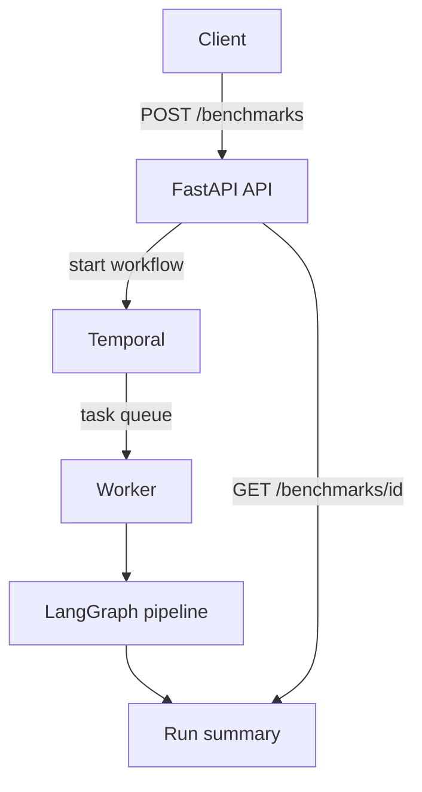
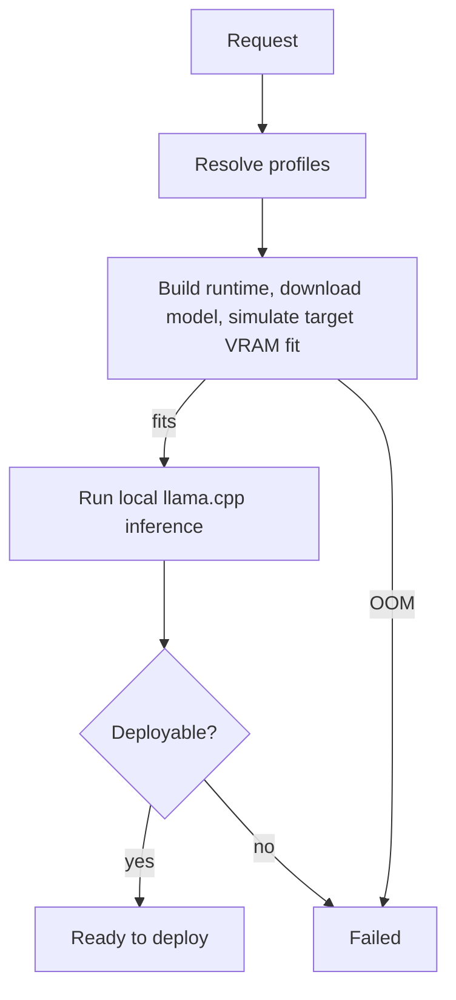
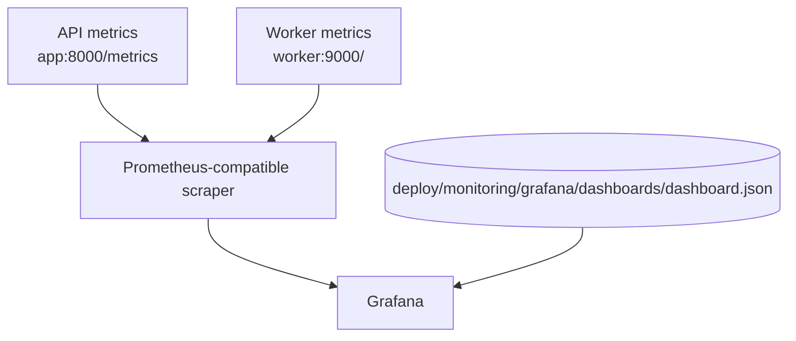
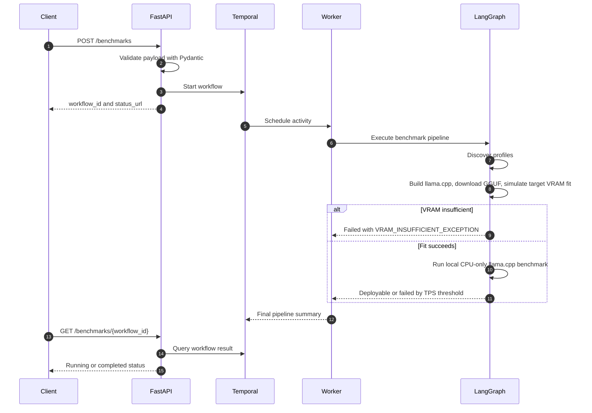
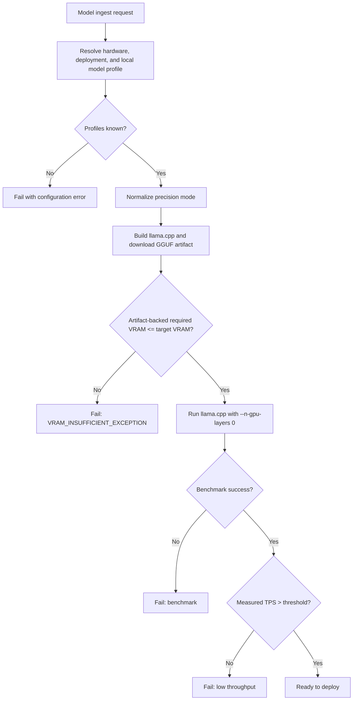
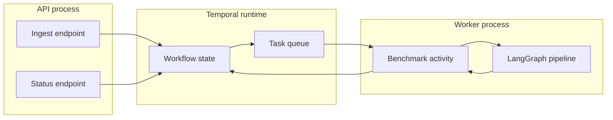
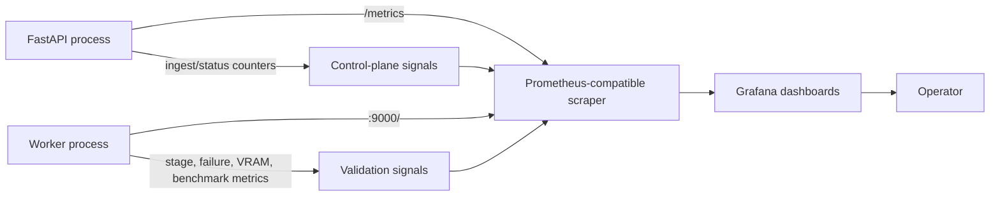

# LLM GPU Benchmarking

A proof of concept for a distributed LLM GPU benchmark control plane.

The project accepts a model request, selects a target hardware and deployment
profile, starts a Temporal workflow, executes a LangGraph pipeline in a worker,
prepares a real local GGUF model with llama.cpp, runs CPU-only inference, and
exposes Prometheus metrics for dashboarding.

This repository treats a local laptop as the production-like environment for the
POC. The control-plane boundaries, deployment paths, validation decisions,
observability, and operational scripts are structured like a real service, while
target GPU provisioning and model-service artifact publishing remain simulated.
The default benchmark path is real local model execution; only target-GPU
capacity and topology are simulated when no physical GPU is available.

## Design Status

| Area | Current status |
| --- | --- |
| API control plane | FastAPI service in `src/main.py` |
| Distributed execution | Temporal workflow plus separate worker process |
| Pipeline orchestration | LangGraph state machine inside the worker activity |
| Local runtime validation | Default llama.cpp source build plus Qwen GGUF artifact download |
| Hardware validation | Artifact-backed target GPU memory simulation |
| Hosted runtime validation | Optional NVIDIA-hosted OpenAI-compatible validation mode |
| Observability | Prometheus metrics and a provisioned Grafana dashboard JSON |
| Local deployment | Helm chart with ingress for Rancher Desktop or another local cluster |
| Production readiness | Local-prod POC; see remaining gaps below |

## Problem Statement

An LLM GPU benchmarking service needs to answer an operational question before spending real GPU
time: can this model run on this target hardware, with this precision mode, in
this deployment environment?

This implementation makes validation data-driven and executable. A request for a
configured local model downloads the real GGUF artifact, builds llama.cpp from
source when needed, runs local CPU inference, exposes measured throughput and
latency, and still fails target-GPU fit for the right reason before claiming a
deployment is viable.

## Goals

- Model the control-plane request lifecycle from ingest to final deployability
  decision.
- Keep API ingestion asynchronous so clients are not blocked by compile and
  benchmark phases.
- Use Temporal for durable workflow orchestration and a separate worker process
  for benchmark execution.
- Use LangGraph to keep pipeline stages explicit and testable.
- Replace hardcoded success responses with a real local LLM execution backend
  that reacts to model artifact size, target VRAM, and precision mode.
- Emit metrics that explain throughput, bottlenecks, failure reasons, worker
  activity, VRAM usage, and precision-mode impact.
- Keep the project runnable locally through one Kubernetes Helm lifecycle script.

## Non-Goals

- This POC does not provision real GPU nodes.
- This POC does not build or publish a real model-service artifact.
- The default validation path does not execute inference on a physical target
  GPU; llama.cpp is forced to CPU execution with `--n-gpu-layers 0`.
- The local Temporal server uses Temporal's development mode, not a production
  persistence backend.
- Authentication, authorization, audit logging, artifact storage, and CI/CD
  hardening are not implemented in the local-prod POC.

## Architecture

### Runtime Components



### Benchmark Pipeline



### Observability



## Component Responsibilities

| Component | File | Responsibility |
| --- | --- | --- |
| API entrypoint | `src/main.py` | Exposes health, metrics, ingest, and status endpoints. Connects to Temporal and starts workflows. |
| Request schema | `src/schemas.py` | Defines `ModelIngestRequest` and `PrecisionMode`. |
| Workflow | `src/workflows.py` | Defines the Temporal workflow wrapper and retry policy. |
| Worker | `src/worker.py` | Connects to Temporal, starts worker metrics, and executes queued activities. |
| Activity | `src/activities.py` | Runs the benchmark pipeline and records Prometheus metrics. |
| Benchmark graph | `src/benchmark_graph.py` | Defines the LangGraph stages and success/failure routing. |
| Local LLM runtime | `src/local_llm_runtime.py` | Builds llama.cpp, downloads GGUF artifacts, runs CPU-only inference, and parses metrics. |
| Local model profiles | `src/config/local_llm_profiles.json` | Maps API model names to Hugging Face GGUF artifacts by precision mode. |
| Validation matrix | `src/validation_matrix.py` | Explicit opt-in deterministic backend for tests and legacy demos. |
| Provisioning facade | `src/mcp_provisioning.py` | Loads hardware/deployment profiles and chooses validation backend. |
| Hosted runtime client | `src/nim_runtime_client.py` | Optional OpenAI-compatible NVIDIA hosted validation client. |
| Metrics | `src/metrics.py` | Owns Prometheus counters, gauges, and histograms. |

## Project Layout

| Path | Purpose |
| --- | --- |
| `src/` | Runtime Python modules for API, Temporal worker, graph, validation, and metrics. |
| `src/config/` | Hardware, deployment, hosted-model, and local GGUF model profile JSON. |
| `test/` | Unit tests for schemas, graph routing, provisioning, and hosted validation. |
| `examples/` | Curl examples and local benchmark load generator. |
| `docs/` | Local production runbook, non-technical overview, and operator-facing documentation. |
| `scripts/` | Kubernetes lifecycle, test, load, and validation scripts. |
| `Dockerfile` | Application image definition used by API and worker containers. |
| `.dockerignore` | Root Docker build-context ignore rules. |
| `helm/llm-gpu-benchmarking/` | Local Kubernetes Helm chart with API, worker, Temporal, service, and ingress resources. |
| `deploy/monitoring/grafana/` | Provisioned Grafana datasource and dashboard. |
| `openapi.yaml` | Checked-in API contract. |

Runtime commands use `PYTHONPATH=src` and module names such as `main`,
`worker`, and `benchmark_graph`.

## Request Lifecycle



1. A client submits `POST /benchmarks`.
2. FastAPI validates the payload with Pydantic.
3. FastAPI creates a unique Temporal `workflow_id`.
4. Temporal stores and schedules the workflow.
5. A worker picks up the workflow activity from `llm-gpu-benchmarking-task-queue`.
6. The worker invokes the LangGraph pipeline.
7. The graph discovers hardware and deployment metadata from JSON config.
8. The graph records a quantized precision profile for `INT8` or `INT4`.
9. The graph prepares the selected backend. In default local mode it builds
   llama.cpp when needed, downloads the configured GGUF artifact, and simulates
   target GPU VRAM fit from the real artifact size.
10. If VRAM is insufficient, the run fails with `VRAM_INSUFFICIENT_EXCEPTION`.
11. If the target GPU fit succeeds, the benchmark harness runs local CPU-only
    llama.cpp inference and emits measured throughput, latency, token, model
    artifact, and simulated target-VRAM metrics.
12. The graph routes the run to publish or failure based on validation success
    and the configured TPS threshold.
13. The activity records metrics and returns the final pipeline summary.
14. A client polls `GET /benchmarks/{workflow_id}` for completion.

## API Contract

The checked-in OpenAPI contract lives at:

```text
openapi.yaml
```

When the API is running, FastAPI also exposes interactive docs at:

```text
http://llm-gpu-benchmarking.localhost/docs
```

### Ingest

```http
POST /benchmarks
Content-Type: application/json
```

```json
{
  "model_name": "Qwen/Qwen2.5-0.5B-Instruct-GGUF",
  "target_gpu": "A10G-24GB",
  "target_environment": "kubernetes",
  "precision_mode": "INT4"
}
```

Fields:

| Field | Required | Notes |
| --- | --- | --- |
| `model_name` | Yes | Exact configured local model profile name or alias from `src/config/local_llm_profiles.json`. |
| `target_gpu` | Yes | Matched against `src/config/hardware_profiles.json`. |
| `target_environment` | No | Defaults to `kubernetes`; matched against deployment targets. |
| `precision_mode` | No | Defaults to `FP16`; supported values are `FP16`, `INT8`, and `INT4`. |

Example response:

```json
{
  "message": "Benchmark run initiated.",
  "workflow_id": "llm-gpu-benchmarking-qwen-qwen2-5-0-5b-instruct-gguf-int4-a1b2c3d4",
  "status_url": "/benchmarks/llm-gpu-benchmarking-qwen-qwen2-5-0-5b-instruct-gguf-int4-a1b2c3d4",
  "precision_mode": "INT4"
}
```

### Status

```http
GET /benchmarks/{workflow_id}
```

While running:

```json
{
  "workflow_id": "llm-gpu-benchmarking-qwen-qwen2-5-0-5b-instruct-gguf-int4-a1b2c3d4",
  "status": "RUNNING"
}
```

After completion:

```json
{
  "workflow_id": "llm-gpu-benchmarking-qwen-qwen2-5-0-5b-instruct-gguf-int4-a1b2c3d4",
  "status": "COMPLETED",
  "pipeline_summary": {
    "model": "Qwen/Qwen2.5-0.5B-Instruct-GGUF",
    "hardware": "A10G-24GB",
    "environment": "kubernetes",
    "precision_mode": "INT4",
    "final_status": "Model_Service_Ready_To_Deploy",
    "deployable": true,
    "error_log": ""
  }
}
```

## Local LLM Validation Design

The default runtime mode is real local validation:

```bash
LLM_GPU_BENCHMARKING_VALIDATION_MODE=local
```

Local mode answers two questions:

- Can the configured GGUF artifact be prepared on this host by building
  llama.cpp and downloading the real model file?
- Given that artifact size, does the simulated target GPU have enough VRAM, and
  what measured throughput/latency does CPU-only local inference produce?



### Core Business Logic

The business decision is not "did the workflow run?" It is "is this configured
model deployable on this target hardware, in this environment, with this
precision mode?"

The pipeline makes that decision in this order:

1. Ingest accepts `model_name`, `target_gpu`, `target_environment`, and
   `precision_mode`, then creates a Temporal workflow with status `Ingested`.
2. Discovery resolves hardware and environment profiles. Unknown labels fail
   instead of falling back to a generic target.
3. Precision handling normalizes aliases such as `4BIT` or `AWQ` to `INT4`.
4. Local compile prepares the runtime: clone/build llama.cpp when needed,
   download the configured Hugging Face GGUF artifact, validate optional size or
   checksum metadata, and record host/runtime details.
5. Target GPU fit is simulated because no physical GPU is available. The
   simulation uses the downloaded artifact size plus runtime overhead and
   compares that value with the configured target topology.
6. Benchmark runs the real model locally through `llama-cli` with
   `--n-gpu-layers 0`, parses llama.cpp performance output, and reports measured
   generation TPS, latency, output tokens, prompt-eval TPS, and model file size.
7. Publish routing requires both `success=true` and
   `tokens_per_second > LLM_GPU_BENCHMARKING_MINIMUM_TPS_THRESHOLD`. The default
   threshold is `100` TPS.
8. Failure handling chooses the most specific reason available: model profile
   error, runtime build/download error, target VRAM OOM, benchmark error, or low
   throughput.
9. The worker records counters, histograms, gauges, stage durations, and the
   final summary returned by `GET /benchmarks/{workflow_id}`.

Decision table:

| Condition | Outcome |
| --- | --- |
| Hardware, environment, or local model profile is unknown | Request/workflow fails with a configuration error. |
| llama.cpp cannot be cloned, built, or found | `Failed`, stage `compile`. |
| GGUF artifact cannot be downloaded or verified | `Failed`, stage `compile`. |
| Simulated target VRAM is lower than artifact-backed requirement | `Failed`, reason `oom`, stage `compile`. |
| Local llama.cpp benchmark exits nonzero or lacks perf metrics | `Failed`, stage `benchmark`. |
| Benchmark succeeds but measured TPS is at or below the threshold | `Failed`, low-throughput reason. |
| Benchmark succeeds and measured TPS is above the threshold | `Model_Service_Ready_To_Deploy`. |

### Local Model Profiles

Local models are configured in:

```text
src/config/local_llm_profiles.json
```

The default profile is `Qwen/Qwen2.5-0.5B-Instruct-GGUF`, with FP16, INT8, and
INT4 GGUF artifacts. Larger models use the same path: add a profile with the
Hugging Face repo, precision-specific GGUF filenames, context size, prompt, and
parameter count. Requests for unconfigured model names fail explicitly; the
service does not silently substitute a smaller model.

### Runtime Artifacts

By default, generated runtime files live under:

```text
.runtime/local-llm/
```

That directory contains the llama.cpp source checkout/build and downloaded model
artifacts. It is intentionally ignored by git. For container or cluster runs,
set `LLM_GPU_BENCHMARKING_LOCAL_LLM_ROOT` to a writable persistent volume if you
do not want to rebuild or redownload across pod restarts.

### Cache And Warmup

Local mode has three cache layers:

| Layer | Cache path | Reused when |
| --- | --- | --- |
| llama.cpp source/build | `.runtime/local-llm/llama.cpp` | `LLAMA_CPP_REPO_URL`, `LLAMA_CPP_GIT_REF`, and `LLAMA_CPP_CMAKE_ARGS` match the cache manifest. |
| Model artifacts | `.runtime/local-llm/models/<repo>/...gguf` | The GGUF file exists and optional configured size/checksum checks pass. |
| Cache manifest | `.runtime/local-llm/cache_manifest.json` | Records runtime build inputs and model artifact metadata. |

Repeated benchmark requests do not reclone llama.cpp, rebuild binaries, or
redownload GGUF artifacts while this cache persists. Downloads are written to a
`.partial` file under a filesystem lock and are atomically moved into place only
after completion. Build and model-artifact locks prevent concurrent workers from
doing duplicate first-use work for the same cache root.

Worker startup warmup is enabled by default in local mode:

```bash
LOCAL_LLM_WARMUP_ON_STARTUP=true
LOCAL_LLM_WARMUP_MODELS=all
LOCAL_LLM_WARMUP_PRECISION_MODES=INT4
LOCAL_LLM_WARMUP_REQUIRED=true
```

With these defaults, the worker builds llama.cpp and downloads each configured
model's INT4 artifact before it attaches to Temporal and starts accepting
benchmark activities. Set `LOCAL_LLM_WARMUP_PRECISION_MODES=all` to predownload
all configured precision artifacts, or set `LOCAL_LLM_WARMUP_MODELS` to a
comma-separated model/alias list to warm only selected models.

GGUF files are monolithic weight artifacts, so the service cannot split a model
into a generic "base layer" plus reusable weight layers unless the model format
and artifact source provide that separation, such as separate LoRA adapters. The
production cache boundary here is therefore runtime binaries plus one cached
artifact per model precision.

### CPU-Only Execution

The default CMake arguments disable Metal:

```bash
LLAMA_CPP_CMAKE_ARGS="-DGGML_METAL=OFF -DBUILD_SHARED_LIBS=OFF"
```

The benchmark command also forces:

```bash
--n-gpu-layers 0
```

This keeps local execution on CPU even on Apple silicon. Target GPU behavior is
only represented by the configured hardware topology and artifact-backed VRAM
simulation.

### Metrics Contract

The benchmark result includes:

- `tokens_per_second`: measured llama.cpp generation throughput.
- `latency_ms`: measured end-to-end subprocess runtime.
- `output_tokens`: parsed llama.cpp generated-token count.
- `prompt_eval_tokens_per_second`: parsed prompt-eval throughput when emitted.
- `model_file_size_gb`: downloaded GGUF file size.
- `required_vram_gb`, `available_vram_gb`, `vram_utilization_ratio`: simulated
  target GPU fit metrics based on the real artifact.

When required target VRAM is greater than target capacity, the compile stage
fails with:

```text
VRAM_INSUFFICIENT_EXCEPTION
```

The worker records this in `llm_gpu_benchmarking_failures_total` with labels
similar to:

```text
stage="compile", reason="oom", model="Qwen/Qwen2.5-0.5B-Instruct-GGUF"
```

### Explicit Matrix Mode

The deterministic validation matrix still exists for fast tests and legacy demo
traffic:

```bash
LLM_GPU_BENCHMARKING_VALIDATION_MODE=matrix
```

Matrix mode does not download a model or run inference. It should not be used as
the production-like local benchmark path.

## Profiles

### Hardware Profiles

```text
src/config/hardware_profiles.json
```

### Deployment Profiles

```text
src/config/deployment_targets.json
```

### Local Model Profiles

```text
src/config/local_llm_profiles.json
```

### Hosted NIM Model Profiles

```text
src/config/model_profiles.json
```

Unknown hardware, deployment, and local model labels are rejected instead of
silently falling back to a generic target.

## Distributed Execution Design

Temporal provides the distributed execution boundary:

- The API process accepts requests and starts workflows.
- The Temporal server tracks workflow state and hands work to workers.
- The worker process runs the benchmark activity.
- The activity invokes the LangGraph pipeline.
- The status endpoint asks Temporal for workflow state and final result.



Current Temporal settings:

- Task queue: `llm-gpu-benchmarking-task-queue`
- Activity timeout: 5 minutes
- Retry attempts: 3
- Non-retryable error types: `UnsupportedProvisioningTargetError`, `ValueError`

The local Kubernetes chart uses Temporal development mode for demos. A production
deployment should use a real Temporal cluster or Temporal Cloud with persistent
storage, namespace isolation, TLS, and operational runbooks.

## Observability Design

The API and worker expose Prometheus-format metrics. In Kubernetes, the chart
adds scrape annotations so a compatible Prometheus setup can collect both
targets:



| Job | Target | Purpose |
| --- | --- | --- |
| `llm-gpu-benchmarking-control-plane` | `app:8000/metrics` | API ingest and control-plane metrics |
| `llm-gpu-benchmarking-worker` | `worker:9000/` | Worker, pipeline, validation, and benchmark metrics |

Key metrics:

| Metric | Type | Labels | Purpose |
| --- | --- | --- | --- |
| `llm_gpu_benchmarking_pipeline_runs_total` | Counter | `model_name`, `target_gpu`, `target_environment`, `status` | Counts completed runs by outcome. |
| `llm_gpu_benchmarking_validated_throughput_tps` | Histogram | `model_name`, `target_gpu`, `target_environment`, `status` | Captures validation throughput. |
| `llm_gpu_benchmarking_validated_latency_ms` | Histogram | `model_name`, `target_gpu`, `target_environment`, `status` | Captures validation latency. |
| `llm_gpu_benchmarking_pipeline_duration_seconds` | Histogram | `stage`, `model_name`, `target_gpu`, `target_environment`, `precision_mode`, `status` | Tracks stage duration from ingest through publish/failure. |
| `llm_gpu_benchmarking_failures_total` | Counter | `stage`, `reason`, `model` | Counts high-signal failures such as compile OOM. |
| `llm_gpu_benchmarking_active_workers` | Gauge | none | Tracks currently active worker jobs per worker process. |
| `llm_gpu_benchmarking_local_llm_benchmark_tps` | Histogram | `model_name`, `target_gpu`, `target_environment`, `precision_mode`, `status` | Measured local llama.cpp generation throughput. |
| `llm_gpu_benchmarking_local_llm_benchmark_latency_ms` | Histogram | `model_name`, `target_gpu`, `target_environment`, `precision_mode`, `status` | Measured local llama.cpp end-to-end latency. |
| `llm_gpu_benchmarking_validation_matrix_benchmark_tps` | Histogram | `model_name`, `target_gpu`, `target_environment`, `precision_mode`, `status` | Matrix-mode simulated throughput. |
| `llm_gpu_benchmarking_validation_matrix_benchmark_latency_ms` | Histogram | `model_name`, `target_gpu`, `target_environment`, `precision_mode`, `status` | Matrix-mode simulated latency. |
| `llm_gpu_benchmarking_vram_required_gb` | Gauge | `model_name`, `target_gpu`, `precision_mode` | Required target VRAM. In local mode, this is simulated from the real GGUF artifact size. |
| `llm_gpu_benchmarking_vram_capacity_gb` | Gauge | `model_name`, `target_gpu`, `precision_mode` | Target VRAM capacity. |
| `llm_gpu_benchmarking_validation_matrix_accuracy_score` | Gauge | `model_name`, `target_gpu`, `precision_mode` | Matrix-mode simulated precision quality score. |

Provisioned dashboard:

```text
deploy/monitoring/grafana/dashboards/dashboard.json
```

The dashboard combines benchmark-level, local-runtime, and matrix-mode panels in
one view.
It is designed to answer:

- How many benchmark runs succeeded or failed?
- Which models, hardware targets, and environments are being exercised?
- Which pipeline stages are bottlenecks?
- Are failures mostly compile-time VRAM failures or benchmark failures?
- How do `FP16`, `INT8`, and `INT4` affect measured local throughput, latency,
  and simulated target VRAM?
- How many worker jobs are active during a load test?

## Service URLs

The local Kubernetes Helm path exposes the API through ingress:

| Service | URL | Notes |
| --- | --- | --- |
| API ingress | http://llm-gpu-benchmarking.localhost | FastAPI control plane through Kubernetes ingress |
| API health | http://llm-gpu-benchmarking.localhost/health | Readiness check through ingress |
| API metrics | http://llm-gpu-benchmarking.localhost/metrics | API metrics through ingress |
| Kubernetes service | `svc/llm-gpu-benchmarking` in namespace `llm-gpu-benchmarking` | Internal `ClusterIP` service on port `8000` |
| Temporal service | `svc/llm-gpu-benchmarking-temporal` in namespace `llm-gpu-benchmarking` | Internal service on ports `7233` and `8233` |
| Worker deployment | `deployment/llm-gpu-benchmarking-worker` in namespace `llm-gpu-benchmarking` | Worker metrics are scraped inside the cluster on port `9000` |

For a compact command-focused runbook, see `docs/OPERATIONS.md`.
For a non-technical project overview, see `docs/NON_TECHNICAL.md`.

## Local Tooling Prerequisites

Install these tools before running the local production-like paths:

| Tool | Used by |
| --- | --- |
| Docker-compatible runtime | Local image builds for Helm |
| Kubernetes cluster, such as Rancher Desktop | Local Kubernetes Helm deployment |
| `kubectl` | Namespace, rollout, and service inspection |
| `helm` | Kubernetes chart install and upgrade |
| `jq` | Command-line JSON output formatting in lifecycle tests and examples |
| Python 3.12+ | Unit tests and load generator |
| `git`, `cmake`, and a C/C++ compiler | First-use llama.cpp source checkout and build in local validation mode |

## Local Kubernetes Run

Kubernetes is included to show how the same control-plane pieces run as cluster
workloads. In this project, Kubernetes runs the API, worker, Temporal demo
components, and service wiring as pods and services. It does not provision real
GPU nodes or publish real model-service artifacts.

Use Kubernetes when you want to validate deployment shape: namespaces, services,
pod configuration, worker/API separation, environment variables, secrets, and
Prometheus scrape annotations.

Helm is used because it packages the Kubernetes YAML into a reusable chart under
`helm/llm-gpu-benchmarking`. Instead of applying many individual manifests by hand,
one `helm upgrade --install` command renders the templates with values from
`values.yaml` and installs or updates the whole release consistently.

Start your local Kubernetes cluster, then deploy with the lifecycle script:

```bash
./scripts/local-helm-deployment.sh up
```

The script:

- verifies Kubernetes access with `kubectl cluster-info` and `kubectl get nodes`
- creates `.env` from `.env.example` if `.env` does not exist
- loads local config values from `.env`
- builds the local app image with `docker build`
- creates the `llm-gpu-benchmarking` namespace
- creates the optional `llm-gpu-benchmarking-secrets` secret when `NVIDIA_API_KEY` is set
- installs or upgrades the Helm release with ingress enabled
- waits for API, worker, and Temporal deployments to roll out
- checks API health through ingress
- writes `.runtime.env` with `BASE_URL=http://llm-gpu-benchmarking.localhost` or your
  custom ingress host

Lifecycle commands:

| Command | Purpose |
| --- | --- |
| `./scripts/local-helm-deployment.sh up` | Build the image, install or upgrade Helm resources, wait for rollout, and check health. |
| `./scripts/local-helm-deployment.sh status` | Show Helm release status, Kubernetes workloads, and API health. |
| `./scripts/local-helm-deployment.sh down` | Uninstall the Helm release and delete the namespace. |

Optional overrides:

```bash
NAMESPACE=llm-gpu-benchmarking \
RELEASE=llm-gpu-benchmarking \
INGRESS_CLASS=traefik \
INGRESS_HOST=llm-gpu-benchmarking.localhost \
./scripts/local-helm-deployment.sh up
```

With ingress enabled, Kubernetes keeps the API service as an internal
`ClusterIP` and exposes HTTP through the cluster ingress controller. This is
closer to a production shape than binding the pod directly to a laptop port.

Call the API through the URL written by the run script:

```bash
source .runtime.env
curl -sS "${BASE_URL}/health" | jq .
```

Submit a request through ingress:

```bash
curl -sS -X POST "${BASE_URL}/benchmarks" \
  -H "Content-Type: application/json" \
  -d '{"model_name":"Qwen/Qwen2.5-0.5B-Instruct-GGUF","target_gpu":"A10G-24GB","target_environment":"kubernetes","precision_mode":"INT4"}' \
  | jq .
```

To stop the Kubernetes release and delete its namespace:

```bash
./scripts/local-helm-deployment.sh down
```

To inspect the current release and API health:

```bash
./scripts/local-helm-deployment.sh status
```

## Send Sample Requests

The local run scripts write `.runtime.env` with the correct `BASE_URL`.
Load it before running curl examples:

```bash
source .runtime.env
echo "${BASE_URL}"
```

Successful local INT4 run on A10G:

```bash
curl -sS -X POST "${BASE_URL}/benchmarks" \
  -H "Content-Type: application/json" \
  -d '{"model_name":"Qwen/Qwen2.5-0.5B-Instruct-GGUF","target_gpu":"A10G-24GB","target_environment":"kubernetes","precision_mode":"INT4"}' \
  | jq .
```

Same local model with INT8 on H100:

```bash
curl -sS -X POST "${BASE_URL}/benchmarks" \
  -H "Content-Type: application/json" \
  -d '{"model_name":"Qwen/Qwen2.5-0.5B-Instruct-GGUF","target_gpu":"H100-80GB","target_environment":"kubernetes","precision_mode":"INT8"}' \
  | jq .
```

Intentional local configuration failure with an unconfigured model:

```bash
curl -sS -X POST "${BASE_URL}/benchmarks" \
  -H "Content-Type: application/json" \
  -d '{"model_name":"Llama-3-70B","target_gpu":"A10G-24GB","target_environment":"kubernetes","precision_mode":"INT4"}' \
  | jq .
```

More examples:

```text
examples/benchmark-curl-examples.md
```

## End-To-End Test

Run a single end-to-end workflow and poll until Temporal completes it:

```bash
./scripts/load-test.sh test
```

The test command reads `.runtime.env` automatically. Override `BASE_URL` only
when testing a non-default endpoint:

```bash
BASE_URL=http://custom-host.localhost ./scripts/load-test.sh test
```

## Generate Load

After the local Kubernetes ingress path is running:

```bash
REQUESTS=5 CONCURRENCY=1 ./scripts/load-test.sh
```

The load test command reads `.runtime.env` automatically. Override `BASE_URL`
only when needed:

```bash
BASE_URL=http://custom-host.localhost REQUESTS=5 CONCURRENCY=1 ./scripts/load-test.sh
```

## Optional Hosted NIM Validation

The hosted validation path is opt-in:

```bash
LLM_GPU_BENCHMARKING_VALIDATION_MODE=hosted
NIM_BASE_URL=https://integrate.api.nvidia.com/v1
NVIDIA_API_KEY=your-nvidia-api-key
NIM_TIMEOUT_SECONDS=30
```

Hosted mode uses `src/nim_runtime_client.py` to:

1. Check `/v1/health/ready` when supported.
2. List `/v1/models` when supported.
3. Submit a short `/v1/chat/completions` benchmark request.
4. Compute tokens per second and latency from the response.

The project does not store, print, or export `NVIDIA_API_KEY`.

## Configuration

Runtime environment variables:

| Variable | Default | Purpose |
| --- | --- | --- |
| `LLM_GPU_BENCHMARKING_VALIDATION_MODE` | `local` | `local` for llama.cpp validation, `hosted` for NVIDIA hosted calls, `matrix` for deterministic test/demo mode. |
| `LLM_GPU_BENCHMARKING_MINIMUM_TPS_THRESHOLD` | `100` in `.env.example` | Minimum TPS required for publish routing. |
| `LLM_GPU_BENCHMARKING_LOCAL_LLM_ROOT` | `.runtime/local-llm` | Runtime cache for llama.cpp source/build outputs and downloaded GGUF artifacts. |
| `LLM_GPU_BENCHMARKING_LOCAL_LLM_PROFILES_PATH` | `src/config/local_llm_profiles.json` | Local model profile manifest. |
| `LLAMA_CPP_REPO_URL` | `https://github.com/ggml-org/llama.cpp.git` | llama.cpp source repository. |
| `LLAMA_CPP_GIT_REF` | `master` | llama.cpp branch, tag, or ref to build. Pin this for repeatable production runs. |
| `LLAMA_CPP_CMAKE_ARGS` | `-DGGML_METAL=OFF -DBUILD_SHARED_LIBS=OFF` | CMake flags; default disables Metal for CPU-only local execution. |
| `LLAMA_CPP_BUILD_JOBS` | `8` in `.env.example`, `4` in Helm | Parallel build jobs for llama.cpp. |
| `LLAMA_CPP_THREADS` | `8` in `.env.example`, `4` in Helm | CPU threads passed to `llama-cli`. |
| `LLAMA_CPP_BENCH_REPETITIONS` | `1` | Repetitions passed to `llama-bench`; raise for more stable metrics. |
| `LOCAL_LLM_DOWNLOAD_TIMEOUT_SECONDS` | `1800` | Timeout for first-use GGUF artifact download. |
| `LOCAL_LLM_BENCHMARK_TIMEOUT_SECONDS` | `900` | Timeout for local llama.cpp inference command. |
| `LOCAL_LLM_CA_BUNDLE` | `certifi` CA bundle | Optional CA bundle override for Hugging Face downloads. |
| `LOCAL_LLM_WARMUP_ON_STARTUP` | `true` | Build/download the configured local runtime cache before the worker accepts Temporal work. |
| `LOCAL_LLM_WARMUP_MODELS` | `all` | Comma-separated model names/aliases to warm, or `all`/`none`. |
| `LOCAL_LLM_WARMUP_PRECISION_MODES` | `INT4` | Comma-separated precision modes to warm, or `all`. |
| `LOCAL_LLM_WARMUP_REQUIRED` | `true` | Fail worker startup if warmup fails. Set `false` for best-effort warmup. |
| `NIM_BASE_URL` | `https://integrate.api.nvidia.com/v1` | Base URL for hosted OpenAI-compatible validation. |
| `NVIDIA_API_KEY` | empty | Bearer token for hosted validation. |
| `NIM_TIMEOUT_SECONDS` | `30` | HTTP timeout for hosted validation. |
| `NIM_MODEL_PROFILES_PATH` | `src/config/model_profiles.json` | Optional model payload profile override. |
| `TEMPORAL_ADDRESS` | `llm-gpu-benchmarking-temporal:7233` in Helm | Temporal frontend address used by API and worker. |
| `TEMPORAL_CONNECT_ATTEMPTS` | `3` API, `12` worker | Connection retry attempts at startup. |
| `METRICS_PORT` | `9000` | Worker metrics listener port. |
| `MAX_CONCURRENT_ACTIVITIES` | `10` | Worker activity concurrency. |
| `LOG_LEVEL` | `INFO` | API and worker logging level. |

## Test Coverage

The unit tests cover:

- Hardware profile matching.
- Deployment target matching.
- Local llama.cpp backend selection and compile/benchmark delegation.
- Hosted runtime client request and response handling.
- Explicit matrix-mode VRAM failure behavior.
- Precision-mode effects in the explicit matrix backend.
- LangGraph success/failure routing.
- Pipeline failure message construction.

Run:

```bash
./scripts/validate-local.sh
```

To run only unit tests:

```bash
PYTHONPATH=src python -m unittest discover -s test
```

## Local Production Readiness Assessment

The current project has local production-like structure in these areas:

- Asynchronous API request handling.
- Workflow orchestration separated from API serving.
- Worker-process execution for long-running stages.
- Config-backed hardware and deployment profiles.
- Real local GGUF inference through llama.cpp with CPU-only execution.
- Specific validation failures with stable error codes.
- High-signal Prometheus metrics and a Grafana dashboard definition.
- Kubernetes chart for API, worker, Temporal demo components, services, and
  ingress.
- Operational scripts for install, uninstall, end-to-end tests, load generation,
  and local validation.
- Pinned Python runtime dependencies.
- Non-root runtime container image.

Before this could become a real shared production system, the following work is
still required:

- Replace Temporal dev server with a managed or self-hosted production Temporal
  deployment.
- Add API authentication, authorization, request quotas, and audit logging.
- Persist run records, pipeline summaries, and artifacts in a database or object
  store outside Temporal history.
- Integrate real GPU inventory and scheduler data instead of static JSON.
- Replace simulated target GPU scheduling and publish steps with actual GPU
  inventory, model-service artifacts, and deployment workflows.
- Add secrets management for API keys and runtime credentials.
- Add structured logging, request IDs, tracing, and alerting.
- Add CI to run tests, linting, JSON validation, and container builds.
- Add dependency and image scanning.
- Add autoscaling, pod disruption budgets, and network policy to Kubernetes
  manifests.
- Add dashboard alerts for OOM failure spikes, worker saturation, pipeline p95,
  and low success rate.

## Public Repo Notes

- NVIDIA hosted NIM integration requires user-provided API access and is subject
  to NVIDIA and model-provider terms.
- The Grafana password is the local demo default `admin` / `admin`; do not use
  it for a shared deployment.
- Product names such as NVIDIA, NIM, and GPU model names are used only to make
  the POC concrete. This project is not affiliated with or endorsed by those
  vendors.
